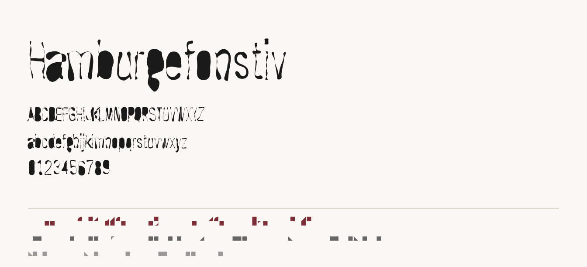

> Part of the [Vector Lab](https://github.com/vector-lab-tools).
> Vector methods for vector theory.
>
> **Tier:** design instrument. **Object:** a latent space of letterforms.
>
> **Sibling instruments:**
> [Vectorscope](https://github.com/vector-lab-tools/vectorscope) ·
> [Manifoldscope](https://github.com/vector-lab-tools/manifoldscope) ·
> [Theoryscope](https://github.com/vector-lab-tools/theoryscope) ·
> [Manifold Atlas](https://github.com/vector-lab-tools/manifold-atlas) ·
> [LLMbench](https://github.com/vector-lab-tools/LLMbench)

# Vectorography

**Type design by traversal.**

**Author:** David M. Berry
**Institution:** University of Sussex
**Version:** see [`VERSION`](VERSION)
**Licence:** GPL-3.0
**Corpus:** Google Fonts, OFL-1.1 families only

Vectorography is an experimental typographic instrument for designing type by
**travelling through a latent space of letterforms**. You do not describe a
typeface and receive one. You arrive somewhere, look at what is there, look at
what is nearby, and decide where to go next. The space is the workspace. The
rendering only shows what a location looks like. The design is the journey.

There is no generate button, and there is no prompt field. This is not an
omission. Every control in the instrument is a movement: a direction, a
distance, a heading, a return. The letterforms are already everywhere in the
space; the work is getting to them, and knowing where you have been.



## The two principles

**Traversal first.** The core screen is a navigator, not a form. A compass rose
shows eight neighbouring positions as eight rendered specimens, so the choice is
between visible places rather than abstract parameters. Every move is recorded
on a trail that can be revisited, branched, and compiled.

**Anti-normalisation.** A latent space fitted to Google Fonts has a dense
neo-grotesque core, and every latent space pulls toward the average of what it
was trained on. This instrument makes that pull visible and resistible. The
altitude meter shows, permanently, how far you are from the corpus centroid and
how crowded your immediate neighbourhood is. REPEL steps directly against the
local density gradient. The nearest-neighbour panel names the five real families
whose neighbourhood you are standing in, so provenance is on screen rather than
buried.

## Quick start

```bash
./run.sh
```

Then open http://localhost:5173.

**The fitted space ships with the repository** as
[**VectorModel 0.1**](MODEL.md) (`backend/data/vectormodel-0.1.npz`, 7 MB), so a
fresh clone can travel immediately: no corpus download, no fitting. The run
script only installs dependencies.

Everything is local. No accounts, no telemetry, and after `npm install` and `pip
install` there are no network calls at all.

To rebuild the space from scratch, for a different corpus size or a different
glyph set:

```bash
.venv/bin/python backend/corpus/fetch.py 500      # download OFL families
.venv/bin/python backend/corpus/outlines.py       # extract and align outlines
.venv/bin/python -c "import sys; sys.path.insert(0,'backend'); \
  import json, numpy as np; from space.style_space import StyleSpace; \
  d=np.load('backend/data/corpus.npz'); \
  StyleSpace.fit(d['X'], d['names'].tolist(), \
                 [json.loads(m) for m in d['metas']]).save()"
```

The raw corpus and the intermediate `corpus.npz` are not committed: they are
large and fully regenerable from `fetch.py` and the manifest.

## Travelling

| Control | Movement |
|---|---|
| **Compass rose** | click any of eight neighbouring positions to go there |
| **Arrow keys** | walk east, north, west, south |
| **Walk radius** | how far one step goes |
| **Drift** (`d`) | random step, scaled by temperature |
| **Repel** (`r`) | step against the local density gradient, away from the crowd |
| **Ride** | make the difference between two families a heading usable from anywhere |
| **Orbit** | circle a chosen family at fixed radius |
| **Trail** | click any stop to return; moving from an earlier stop opens a branch |
| **Backspace** | back to the previous stop |

The eight compass bearings are 45-degree steps in a **heading plane** spanned by
two of the space's axes. The plane selector prints each axis's share of corpus
variance, because which plane you turn in is a choice about which directions of
variation you treat as the important ones. REPEL is not confined to the plane:
it uses the density gradient in the dominant style subspace and will take you out
of whatever plane you are turning in.

## Export

Everything is under **File** in the menu bar.

**Export Typeface (OTF / TTF).** The current location as one installable static
font. The OTF carries cubic Bezier outlines converted from the same Catmull-Rom
construction the navigator draws with, so what you looked at is what you install:
no requantisation, no second approximation. Metrics, x-height, cap-height and
naming are filled in properly and `fsType` is 0, so it installs in Font Book and
sets text like any other font.

**Compile Journey to Variable Font.** The recorded path becomes a **variable
font**. The trail is sampled at uniform arc length, each sample is decoded and
compiled as a master, and `varLib` builds a variable font whose single `JRNY`
(Journey) axis runs from the start of the journey to its end, with a named
instance and a STAT entry per stop so the stops appear as selectable styles.

The journey is the axis of the font.

The zip contains:

```
specimen.html          open this first: tests everything in a browser, no install
<Family>-VF.ttf        the variable font, one Journey axis, named instance per stop
instances/             each stop as a static OTF, ready to install
masters/               the TrueType masters the variable font interpolated from
journey.designspace    the designspace varLib was given
journey.json           the full path in latent coordinates, and the model it belongs to
corpus-manifest.json   every family the space was fitted from
README.txt             what each of the above is
```

**Export Specimen Sheet (SVG).** The current location as a specimen sheet with
its map reading (distance from centroid, density percentile, isolation, and the
five nearest real families) printed on it. The reading travels with the artefact.

## How it works

```
OFL corpus  ->  style vectors  ->  latent space  ->  navigator  ->  variable font
(fontTools)     (fixed length)     (whitened PCA)    (browser)      (varLib)
```

**Style vectors.** Each font becomes one vector of 14,942 floats: 62 glyphs
(A-Z a-z 0-9), three contours each, forty points per contour resampled at uniform
arc length, plus sixty-two advance widths. Contours are sorted by area, wound
consistently, and put into **cyclic correspondence across the whole corpus** by a
Procrustes fit, so point *i* of a contour lands in the same place on the letter in
every font. That correspondence is what makes the space walkable. Without it the
average of two fonts is noise rather than a letter, which is worth stating plainly
because it was the single change that made this work at all.

**The space.** [VectorModel 0.1](MODEL.md): a whitened 128-dimensional principal
subspace of the corpus,
retaining 96% of variance. It was chosen for traversability rather than fidelity:
encode and decode are exact linear maps, so every point in the space decodes to
well-formed contours and every move is continuous. Whitening makes one unit of
distance mean the same thing on every axis, so a compass radius is a real
quantity.

The axes are corpus eigendirections. They were learned from the distribution
rather than declared by a designer, and the instrument says so in the plane
selector.

**Density.** A Gaussian KDE with an analytic gradient, estimated over the eight
dominant style directions rather than all 128. In the full whitened space
distances concentrate, the kernel goes flat, and the meter reads the same
everywhere; the crowding this instrument exists to show is crowding in the
directions along which typefaces actually vary.

**Compilation.** Every master is built with the same glyphs, the same contour
counts, and the same point counts, written directly into the `glyf` table rather
than through a pen. Any set of sampled locations is therefore interpolation
compatible and `varLib` needs no repair step.

### On DeepSVG

DeepSVG was the first choice for the latent space and was rejected after
evaluation. It pins `torch==1.4.0`, `numpy==1.16.1`, Python 3.7 and the withdrawn
`sklearn` shim package, none of which install on a current interpreter, and its
font model depends on a paid dataset. The space here was built instead.

## Provenance and licensing

The corpus is drawn **only** from the `ofl/` tree of
[google/fonts](https://github.com/google/fonts), which is the SIL Open Font
Licence tree. No other font source is permitted by the ingest code. This is a
design decision rather than a convenience: an instrument that shows you whose
neighbourhood you are standing in should be able to say where its ground came
from. `backend/data/corpus-manifest.json` records every family used, and travels
inside every journey export.

Vectorography itself is GPL-3.0. Outlines you export are derived from OFL-1.1
families; check the OFL terms before distributing a typeface built with it.

## Limitations

This is a prototype, and the following are known and deliberate.

- **Outline quality is not production quality.** Forty points per contour, no
  hinting, no kerning, no overlap removal. Exports are for study and specimen,
  not for retail release.
- **Interpolating across structural change produces blobs.** A letter with one
  counter interpolated against a letter with two passes through intermediate
  states where the padded contour opens up. This is shown rather than hidden.
- **Latin only.** The representation assumes a fixed glyph set with stable
  contour counts. Cursive-connected and contextual scripts need a different
  representation, and that is the interesting next problem rather than a detail.
- **Density saturates far out.** Past the corpus hull the density percentile pins
  at zero, which is why distance from the centroid is reported alongside it.

## Repository

```
backend/
  corpus/fetch.py       OFL-only corpus download and manifest
  corpus/outlines.py    outline extraction, resampling, corpus alignment
  space/style_space.py  the latent space, density, and travel primitives
  data/vectormodel-*.npz  the fitted space, see MODEL.md
  export/fontfile.py    master and variable font compilation
  render.py             contours to SVG
  main.py               FastAPI: location, compass, travel, export
frontend/src/
  App.tsx               the navigator
  components/           compass rose, altitude meter, neighbours, trail, travel bar
DESIGN.md               design of record, including the pre-build review
```

## Citation

```bibtex
@software{berry_vectorography_2026,
  author  = {Berry, David M.},
  title   = {Vectorography: Type Design by Traversal},
  year    = {2026},
  url     = {https://github.com/vector-lab-tools/vectorography},
  license = {GPL-3.0}
}
```

## Versioning

`VERSION` at the repository root is the single source for the **application**
version. The fitted space carries its own version (see [MODEL.md](MODEL.md)),
because refitting invalidates saved journey coordinates even when no code has
changed.

`VERSION` at the repository root is the single source. The backend reads it at
import, the frontend inherits it at build time through `vite.config.ts`, and
`tools/sync_version.py` stamps it into `CITATION.cff`, which needs a literal
because citation metadata has to stand alone. `frontend/package.json` carries no
version of its own.

Versions move in steps of 0.01, and only when agreed.
